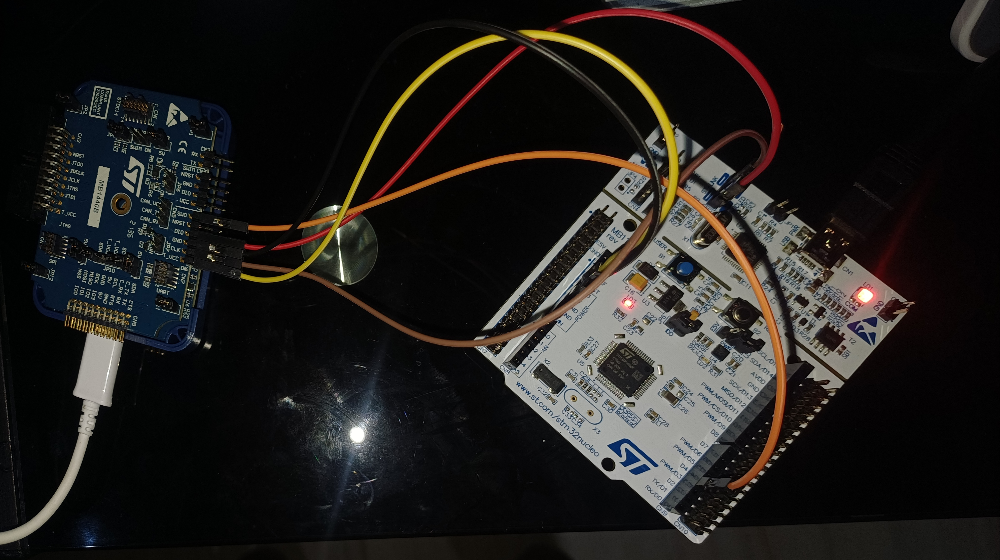
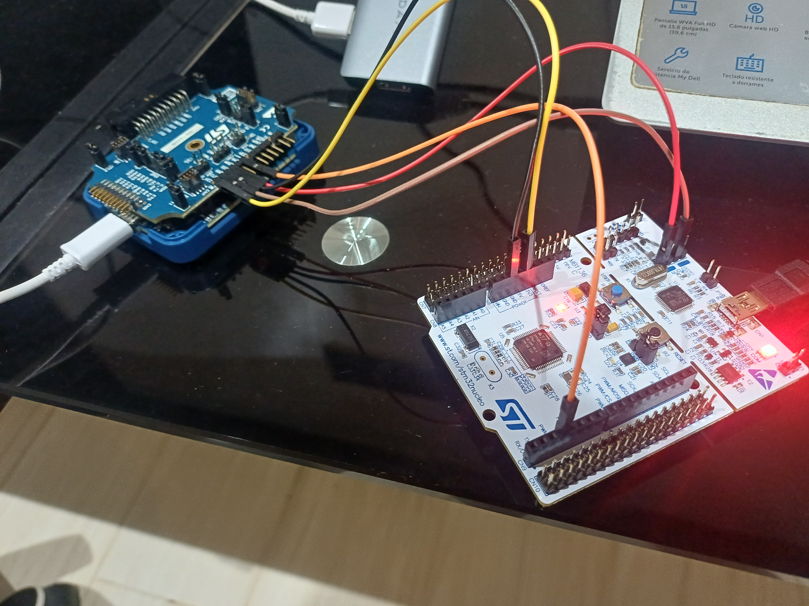
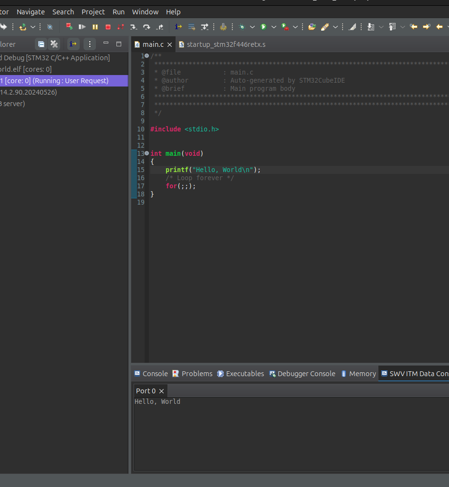
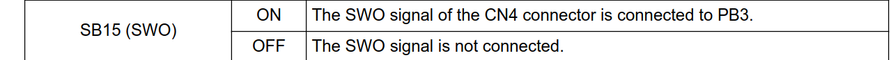
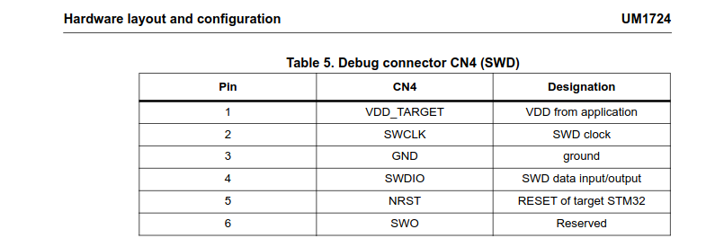
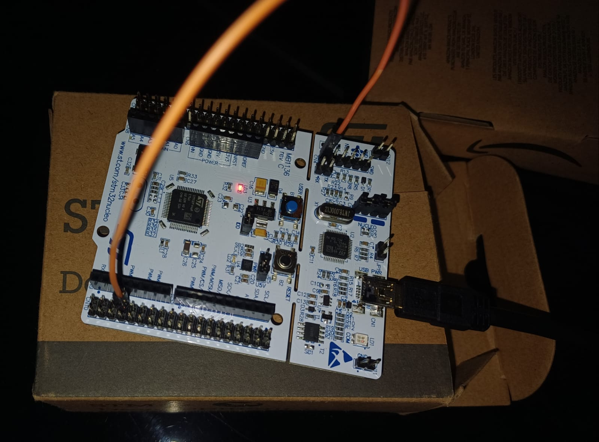
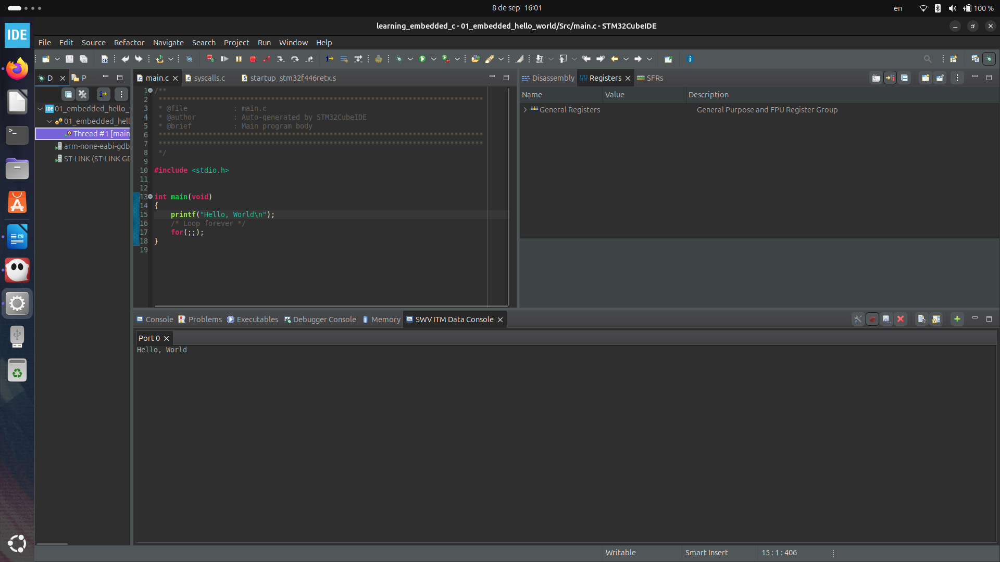

# Project 01: Embedded Hello World via ITM

## Objectives: 
* Implement the standard **`printf`** function on ARM Cortex-M4 STM32 F446RE-NUCLEO microcontroller without relying on a full operating system (Bare-Metal).
* Redirect the printf output to the ITM (Instrumentation Trace Macrocell unit) inside the microcontroller and read the output via SWD (Serial Wire Debug) protocol.

## Technical Insights: Redirection of *printf* to ITM:
In the host desktop environment like Ubuntu linux, *printf* relies on system calls managed by the operating system to print a certain stream of bytes to the terminal. Whereas, in **bare-metal embedded systems**, there's no such a thing as an OS managing those system calls. So, we must tell the cross compiler where to send those bytes. 

This is achieved by calling the the 'ITM_SendChar(*ptr++)' function, with a pointer to traverse the buffer as the function argument, all of this within the body of '_write()' function inside the **syscalls.c** source file.

The ITM unit inside the microcontroller serializes these bytes and transmits them through a single physical pin: SWO (Serial Wire Output), labeled as D3 on the STM32 F446RE-NUCLEO microcontroller.

The SWD uses the following pins: 
* **SWDIO**: for debug related data
* **SWCLK**: a clock driven by the debugger to synchronize the flow of data.
* **SWO**: to capture the printf data writen inside the ITM, sending it to the host machine for SWV (Serial Wire Viewing).

## Challenges & Solutions:

### Challenge:
When I first tried to reproduce the lab in a similar fashion as the professor, I realized I couldn't get the "Hello, World" printed on my SWV console. After doing some research I discovered that the SWO pin (D3) on the STM32 F446RE-NUCLEO microcontroller was not routing to the SWD pins and thus to the USB port. So it was impossible to trace the data from the ITM by SWD only depending on the integrated STLINK/v2 integrated on the board. 

### Solution:
I realized that I needed to use an external debugger in order to transmit the output data from the ITM buffer to the usb port and thus, to my SWV console on the IDE. So, after doing some research and reading documentation, I realized how to do the connections via female-male and female-female jumper wires between the SWD pins from the STLINK/V3-SET and the STM32 F446RE-NUCLEO board. 
The information can be replicated following the upcoming table:

## Hardware Connection Matrix

To replicate this debug environment, the physical connection between the ST-LINK/V3 and the NUCLEO-F446RE must be exactly as follows (selection of colors is optional):

| ST-LINK/V3 Signal (CN7) | Cable Color | Target NUCLEO-F446RE Pin | Purpose |
| :--- | :--- | :--- | :--- |
| **`T_VCC`** | Yellow | CN6: Pin 4 (`3V3`) | Measure and adapting to the board voltage |
| **`GND`** | Black | CN6: Pin 6 or 7 (`GND`) | Shared ground |
| **`CLK`** | Brown | CN2: Pin 2 (`SWCLK`) | SWD Clock Signal |
| **`DIO`** | Red | CN2: Pin 4 (`SWDIO`) | SWD Bi-directional Data |
| **`SWO`** | Orange | CN9: Pin 4 (`D3`) | Tracing Data from the ITM |

Using the external debugger made possible to capture the data from the SWO pin and actually receive it via USB on the host machine, thus it was possible to print it on the SWV console.

## Verification & Screenshots:

This is how I made the connection on my own hardware between the external debugger and the development board:

And the following image is the verification of the output being shown on the SWV console through port 0:

## Important update:

After learning how to read technical documentation, and after developing project 02 and 03. For project 04 I needed to print the output of a keyboard pressed key to the SWV console of the STM32 CubeIDE. So I returned to this documentation and after doing serious research on the STM43F446xx user manual I discovered the following data:

* According to the user manual of the STM43F446xx, the SWO signal of the embedded ST-Link V2 debugger (pin 6 of CN4) is connected to PB3 pin on CN10:

* What was lacking was the physical path from PB3 pin to SWO (CN4 pin 6) for driving the signal, so i created that path using an F-F jumper wire, as follows:

* Finally I could get the hello, world! message printed on the SWV console:

* Even though I simplified the process a lot, I still value the experience of researching on how to connect an external debugger to get the message from the ITM unit and send it via USB to the host machine and printing it on the SWV console.

