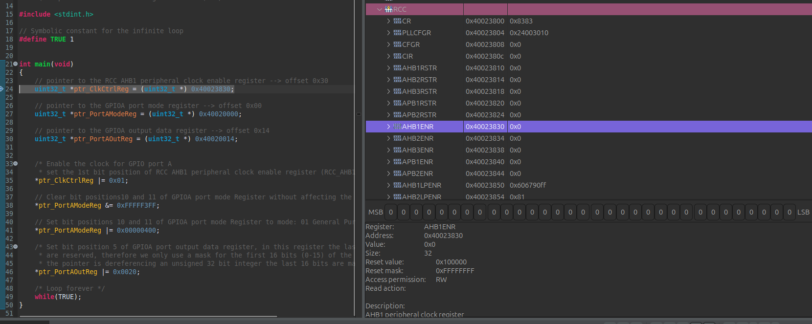
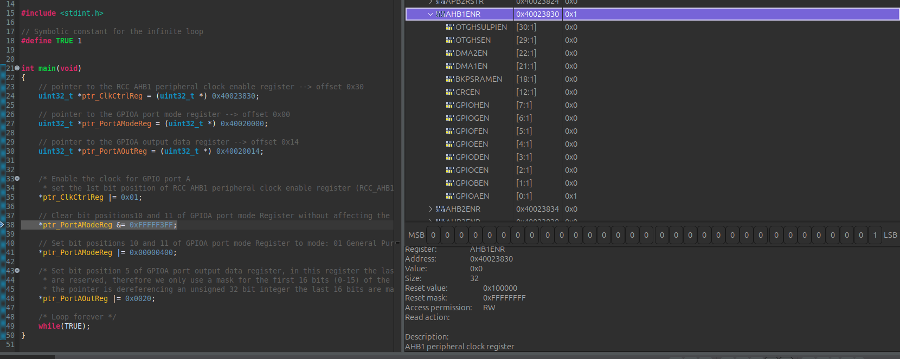
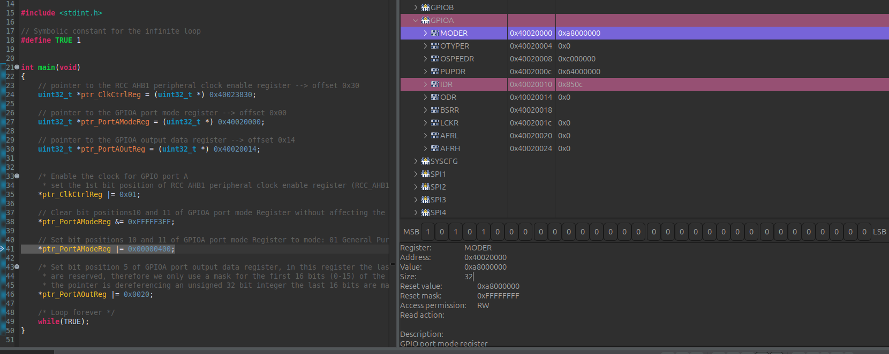
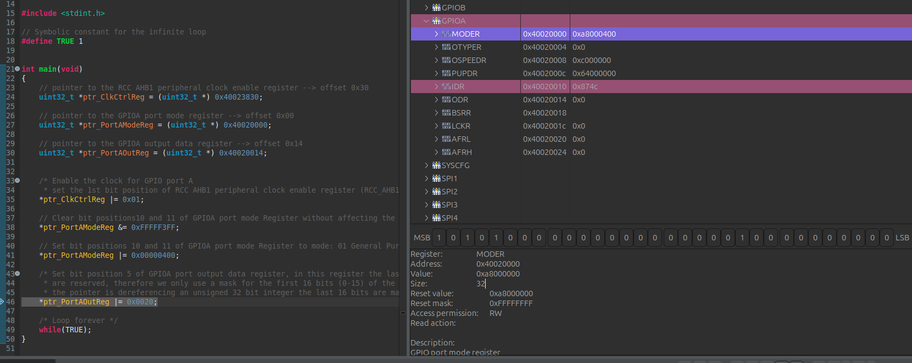
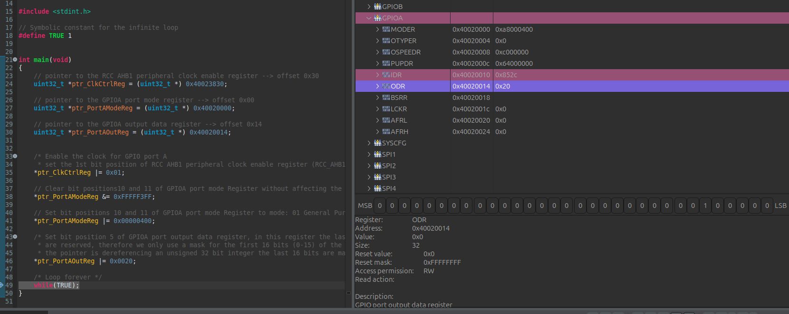
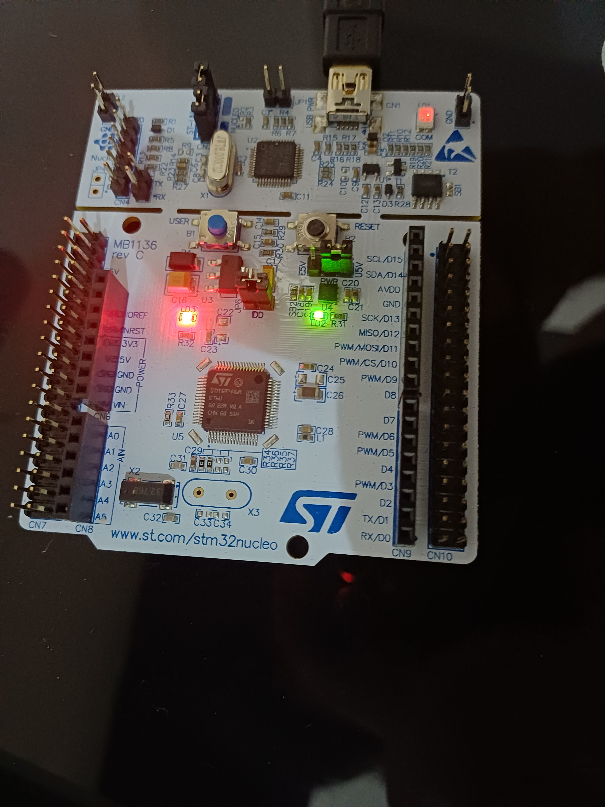
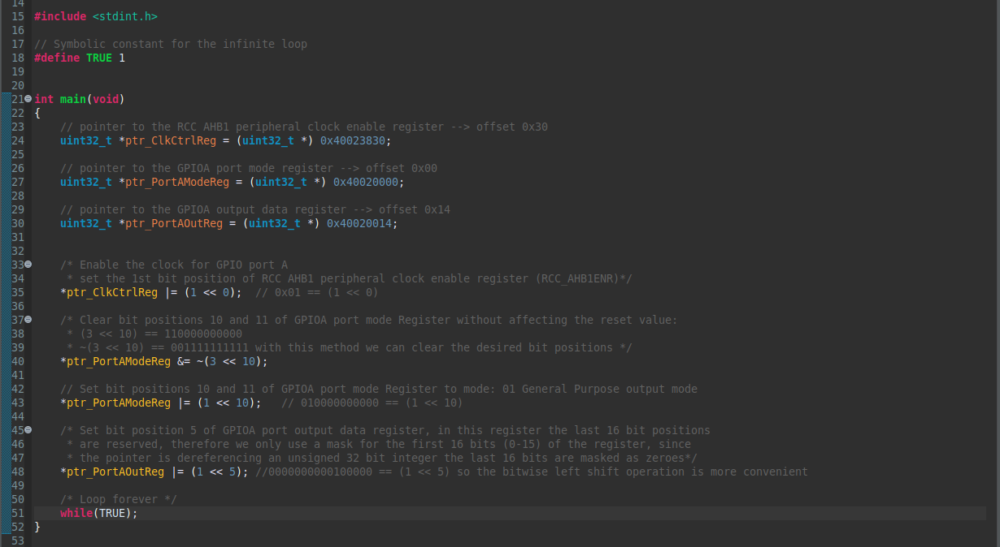

# Project 02: Not your typical blinky

### Quick note for the reader:
First of all, I wanted to highlight the fact that the title of this project may have made you wonder: why is this blinky not a typical blinky?

The answer to that question comes from the effort I made while doing some research on the STM32 Nucleo-F446RE board's datasheet, user manual, schematic, and reference manual in order to find the hardware connections needed to turn ON the green user LED LD2, including finding the right system bus, the right GPIO peripheral, the appropriate RCC peripheral registers, as well as the required GPIO registers, such as GPIOx_MODER and GPIOx_ODR which are explained in the next sections. 

It's also worth mentioning that I used the multimeter in order to check the resistance found in the closed circuit between LD2 and PA5 (GPIO port A pin number 5), besides that I added 2 volts from the multimeter in order to check if there was a closed circuit there.

The last reason is that I didn't use any Hardware Abstraction Layers from any external library, this Blinky is 100% Bare-Metal programmed using the C programming language. 

So, this is not your typical blinky.   

## Objectives:
* To turn on the green led (LD2) on ARM Cortex-M4 STM32 F446RE-NUCLEO microcontroller without relying on HAL (Hardware Abstraction Layers) or any operating system (Bare-Metal).
* To read ARM Cortex-M4 STM32 F446RE-NUCLEO microcontroller's schematic (MB1136-C-03) to find the LD2 and the SB's (solder bridges) involved on its path to a certain pin on the board (PA5). 
* Read the user manual (UM1724), section 7.11 in order to check the solder bridges interacting with LD2 on its way to the PA5 pin on the board.
* To use the AstroAI DM6000AR multimeter in order to find out if there is a closed circuit between the LD2 and the PA5 pin. 
* To consult the STM32 F446RE-NUCLEO microcontroller's datasheet in order to find the board's block diagram to figure out what bus connects the GPIO port A peripheral to the processor.
* To consult the STM32 F446RE-NUCLEO reference manual in order to find the memory map of the board, and there, to obtain the base memory addresses of GPIOA and RCC peripherals.
* To consult the STM32 F446RE-NUCLEO microcontroller's reference manual in order to find the offset and the reset values of RCC AHB1 Enabler Register (RCCAHB1ENR), GPIO port A Mode Register (GPIOA_MODER) and GPIO port A Output Data Register (GPIOA_ODR).
* To develop a program in Bare-Metal, using the C programming language to manipulate the appropriate peripheral registers using pointers, bitmasks and bitwise operations to turn ON the LD2 green user LED.

## Technical Insights:

## 1. Finding the green user LED LD2 on the board's schematic and User Manual:

Before diving into technical details, let's take a look at the microcontroller's schematic (MB1136-C-03):

Looking closer at the extension connectors page, we can identify the LD2 user LED and trace its electrical path through the board.

Following the connection from LD2, we first encounter a 510 ohm resistor. The electrical path then passes through solder bridge SB21, which is closed by default, allowing current to flow through this path.

After SB21, the signal reaches a junction where LD2 is connected to Arduino pin D13 on connector CN9. At this point, two possible routing paths can be observed.

The first path goes through solder bridge SB29. However, according to the schematic, SB29 is only closed for the STM32F302R8 variant. Therefore, on the STM32F446RE board there is no electrical connection between LD2 and PB13.

The second path goes through solder bridge SB42, which is closed by default. As a result, LD2 is electrically connected to PA5. This observation is critical because it allows us to identify the GPIO pin responsible for controlling the green user LED.

Section 7.11 of the user manual (UM1724), confirms that the solder bridge is connected to Arduino's D13, exactly as stated before.

 

This proves that the electrical current flows through SB21 in order to reach Arduino. 

There's also a more physical approach so to speak, to find if a solder bridge is closed or not. For that purpose, let's take a look at the STM32 F446RE-NUCLEO board's backside:

 

If a certain solder bridge has a resistor (the black one with a 0 on the center) connecting both metal sides, that SB is closed. On the other hand, if there's no resistor connecting both sides, the SB is open, hence the electrical current doesn't flows through it. 

**Notice that SB21 and SB42 both have the resistor connecting both sides, so there's indeed a closed circuit between LD2 and PA5, Furthermore, the SB29 doesn't present the black resistor, hence it's open**

## 2. Using the multimeter to test if there's actually a closed circuit between LD2 and PA5:

Other way to prove that there's a closed circuit between LD2 and PA5 is using the multimeter, passing 2 Volts through its probes to check if LD2 turns ON the green light. If it does, there's indeed a closed circuit between LD2 and PA5, and that's exactly what I proved with the following image.

 

According to the schematic, there's a 510 ohms resistance between LD2 and SB21, if there's a closed circuit between LD2 and PA5, one can measure the resistance, as follows.

  

I actually measured the resistance in kiloohms so the resistance we found was 0.511 kiloohms (511 ohms), which is almost exactly as stated by the schematic.

The conclusion is: **there's a closed circuit between LD2 and PA5.**

## 3. Using the STM32 F446RE-NUCLEO board's reference manual to find the appropriate peripheral registers, and manipulating them with pointers and bitwise operations:

Before manipulating the GPIO registers to work with PA5 pin, I look into the STM32 F446RE-NUCLEO board's datasheet for the board's block diagram:

This block diagram reveals that the GPIO Port A peripheral is connected to the AHB1 system bus, so in order to manipulate the GPIOA registers, I need to enable the bus for the GPIO Port A peripheral using the **RCC AHB1 peripheral clock enable register (RCC_AHB1ENR)**. In order to do that, I must refer to the reference manual memory map, to find the starting address of the RCC peripheral:

After finding the starting memory address of the RCC peripheral, it's necessary to find the RCC AHB1 peripheral clock enable register (RCC_AHB1ENR) also in the reference manual:

Now I have the offset value, it has to be added to the starting memory address of the RCC peripheral in order to get the exact memory address of this register so:

0x40023800 + 0x30 = 0x40023830

Now that I have the memory address of the RCC_AHB1ENR, there's another important value, which is the reset value, in other words, the value stored by default inside the register when the STM32 F446RE-Nucleo is turned ON, in this case the value is 0x00000000. 

Next I must find the correct bit position in order to enable the clock for the GPIO port A peripheral, as one might guess, by looking at the reference manual, it's the bit position 0. Hence, I must SET the value stored in bit position 0, from 0 to 1.
For that purpose I use a bitwise OR operation as will be shown later.

The next step is to configure the PA5 pin to output mode, for that purpose I need to go to the reference manual and look for the starting address of the GPIOA peripheral:

After that, I must find the correct register for changing the mode of the GPIOA PA5 pin to output mode, and it happens to be the **GPIO port mode register (GPIOx_MODER):**

there's a lot of valuable data in the reference manual about the GPIOx_MODER:

Address offset: 0x00

Reset value for GPIOA is: 0xA8000000

In the same way as before, the address of the GPIOx_MODER is obtained by adding the offset value to the starting address of the GPIOA peripheral, but since the address offset is zero, the address of GPIOA port mode register is: 0x40020000

to set the mode for PA5 as output its necesary to manipulate only the bit positions 10 and 11 (MODER5), using bitwise AND operation in order to clear both bit positions and after that, using bitwise OR to set the bit position 10 stored value to 1, by doing this the mode is set as 01: General purpose output mode.

After I set the PA5 GPIO pin to output mode, there's still one last register to manipulate, and that is the **GPIO port output data register (GPIOx_ODR)**, its necessary to consult the reference manual in order to find the relevant data:

important information found in this section is:

Address offset = 0x14

GPIOA_ODR address:
0x40020000 + 0x14 = 0x40020014

Reset value: 0x00000000

Now I have the address of the GPIOA_ODR register and the rest value. The next step is finding out what pin is necessary to set ON. For setting ON PA5 pin, I need to store the value 1 inside the bit position 5.
this is done with a bitwise OR operation.

After all the above is done, the green user LED must be turned ON. 

## 4. Hardware Mapping & Register Reference

To implement this bare-metal driver, the following hardware resources, memory-mapped registers, and physical pins were analyzed and manipulated:

| Category | Parameter / Resource | Value / Address | Description / Hexadecimal Mask |
| :--- | :--- | :--- | :--- |
| **MCU Core** | Architecture | ARM Cortex-M4 | 32-bit NUCLEO-STM32F446RE |
| **Peripheral** | RCC Base Address | `0x40023800` | Reset and Clock Control peripheral boundary |
| **Peripheral** | GPIOA Base Address | `0x40020000` | General Purpose I/O Port A boundary |
| **Register** | `RCC_AHB1ENR` | `0x40023830` | Clock enable register (Offset: `0x30`) |
| **Register** | `GPIOA_MODER` | `0x40020000` | GPIO Port A mode register (Offset: `0x00`) |
| **Register** | `GPIOA_ODR` | `0x40020014` | GPIO Port A output data register (Offset: `0x14`) |
| **Bitmask** | Clock Enable Mask | `0x00000001` | SET Bit position 0 to `1` to enable the clock for GPIOA peripheral |
| **Bitmask** | GPIOA_MODER Clear Mask | `0xFFFFF3FF` | Clears Bit positions 10 and 11 via bitwise AND to safely reset the field |
| **Bitmask** | GPIOA_MODER Set Mask | `0x00000400` | Turns Bit positions 10 and 11 to `01` via bitwise OR for General Purpose Output mode |
| **Bitmask** | GPIOA_ODR Set Mask | `0x00000020` | SET Bit position 5 to `1` via bitwise OR in order to drive PA5 HIGH |
| **Hardware** | User LED | `LD2` (Green) | On-board LED connected to `PA5` |
| **Solder Bridge**| Factory Routing | `SB42` (ON) / `SB29` (OFF) | Routes `PA5` to LED; isolates `PB13` |
| **Physical Pin** | Arduino Connector | `D13` (CN5 - Pin 6) | Shared routing with User LED for Shield compatibility |
| **Physical Pin** | Morpho Connector | `CN10 - Pin 11` | Physical GPIO port A pin number 5 (PA5)|

## 5. Developed Bare-Metal C program for manipulating bits inside peripheral registers and turning LD2 green user LED ON

The following images contain the source code I wrote using the C programming language for embedded systems, using deterministic sized types from stdint.h, let's take a look:

 

I included **stdint.h** in order to gain access to deterministic sized types. After that I created a symbolic constant named 'TRUE', the replacement text is 1. 
Then I created three pointer variables in order to hold the memory addresses of the peripheral registers that I needed to manipulate:

***ptr_ClkCtrlReg**: holds the memory address of the RCC_AHB1ENR, I manipulate this register in order to enable the clock for the peripherals connected to the AHB1 bus (including the GPIOA peripheral as mentioned before).

***ptr_PortAModeReg**: stores the address of the GPIOA port mode register (GPIOA_MODER). This register is used in order to set the PA5 pin to output mode, which is needed in order to turn the LD2 ON.

***ptr_PortAOutReg**: holds the memory address of the GPIOA port output data register (GPIOA_ODR). I SET ON the bit position 5 of this register in order to turn ON the LD2.

the first thing I did was to enable the clock for the GPIO port A peripheral, for that purpose I used a bitwise OR operation using the bit mask 0x01 to set the bit position 0 of the RCC_AHB1ENR ON (As shown on line 35).

After that, I cleared the bit positions 10 and 11 of GPIOA_MODER using bitwise AND operation with the 0xFFFFF3FF mask. Then I used bitwise OR operation to set bit position 10, using the bit mask 0x00000400 in order to make the pattern of bit positions 10 and 11 as binary 01 (as shown in lines 38 and 41), which means general purpose output mode.

Finally, I set the bit position 5 of GPIOA_ODR by using bitwise OR operation with the bit mask 0x0020. After this is done the LD2 green user LED actually turns ON. 

In the final step, control goes to an infinite while loop in order to keep the LED ON). 

## Showing the execution of the program step by step while keeping track of the peripheral registers stored values

In this section, using the debug mode of STM32CubeIDE I'm going to show the step by step execution of the code while gazing at each bit position of the peripheral registers

The image above reveals the initial state or reset value of AHB1ENBR which is zero.

after line 35 is executed, the bit position 0 of the AHB1ENBR is set, which means that the clock is enabled to all peripherals connected to AHB1 bus.

Once line 38 gets executed, the bit positions 10 and 11 of GPIOA_MODER are cleared, which means, they become zero, even though those where the reset value of those bits, it's important to clear these positions, making sure they hold zero value before stting bit position 10 and configure the mode of PA5 pin to output mode.

After line 41 is executed bit position 10 gets SET, and the bit pattern of MODER 5 get's configured to output mode.

Once line 46 is executed, the bit position 5 of GPIOA_ODR gets SET and starts outputing a HIGH voltage, and turning the LD2 ON, as show in the image below:

## Update: Code Refactoring using Bitwise Shift Operations

Once the fundamentals of manual hexadecimal masking were mastered, I updated the codebase and refactored it in order to implement bitwise shift operations that enhance code readability, maintainability, and save some time that otherwise would be spent finding manual hexadecimal bit masks.

### Technical enhancements: 

**Automating the process of creating bitmasks:** with bitwise shift operations I just need to consider the bit positions to be set or cleared and then adding the decimal number that matches the pattern of one's (1) as an operand of a bitwise left shift operation, while the other operand is the number of bit positions needed in that particular instruction. That is implemented through a bitwise OR operation in order to set certain bit positions or a bitwise AND operation if I need to clear them, in this case one must negate the bitwise shift operation in order to dynamically obtain the appropriate bit mask.

**Improving readability and maintainability of the program:** Hexadecimal bit masks look like magic numbers, because in order to truly understand whats they're doing for us, it's necessary to translate the mask's value into binary and do the bitwise operation. Whereas bitwise shift operations are less casuistic, we just use the appropriate operands and right or left shift operation needed to set or clear certain bit positions.

Here is the refactored source code of the Bare-Metal blinky program, with some commenting on the process of switching from hexadecimal bit masks to bitwise shift generated bit masks: 

   
