# Project 02: Not your typical blinky

## Objectives:
* Turn on the green led (LD2) on ARM Cortex-M4 STM32 F446RE-NUCLEO microcontroller without relying on HAL (Hardware Abstraction Layers) or any operating system (Bare-Metal).
* Read ARM Cortex-M4 STM32 F446RE-NUCLEO microcontroller's schematic (MB1136-C-03) to find the LD2 and the SB's (solder bridges) involved on it's path to a certain pin on the board (PA5). 
* Read the user manual (UM1724), section 7.11 in order to check the solder bridges interacting with LD2 on its way to the PA5 pin on the board.
* Use the multimeter to find out if there is a closed circuit between the LD2 and the PA5 pin. 

## Technical Insights:

## 1. Finding the green user LED LD2 on the board's schematic and User Manual:

Before diving into technical details, let's take a look at the microcontroller's schematic (MB1136-C-03):

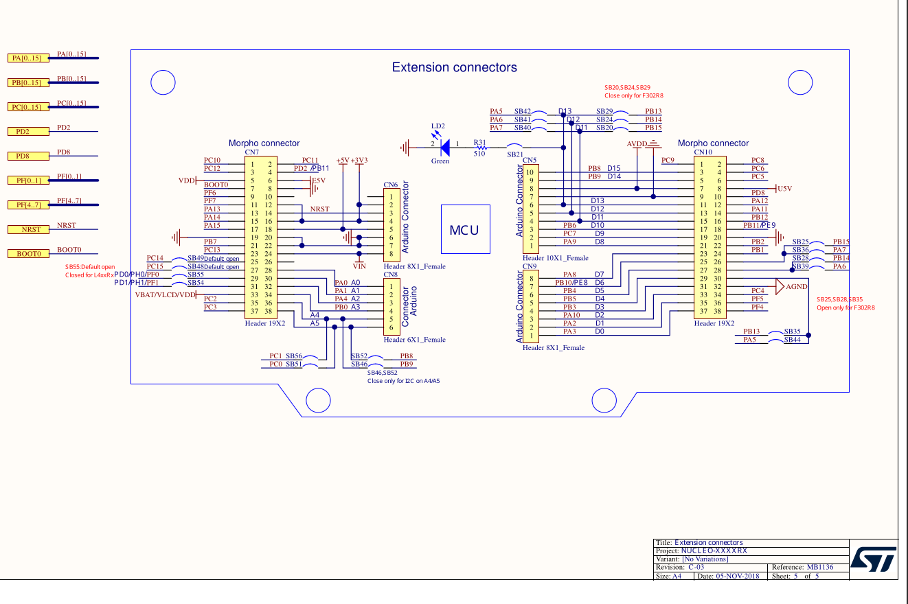

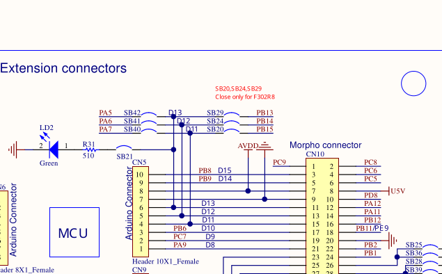

Looking closer to the extension connectors page, we can find the LD2, and following the right path, there's a resistor with a resitance of 510 ohms. traversing the path there's the solder bridge SB21 which is closed, so the current flows through it and reaches a bifurcation here it's notorious that LD2 is connected to the Arduino's Pin number 6 (D13) on CN9 module.LD2 also reaches the D13 line and here there are two possible paths. Despite that, in red letters one can tell that the SB29 is only closed for F302R8 microcontroller, that mean there's no connection between LD2 and PB13. On the other hand, SB42 is closed, hence LD2 is connected to PA5, and this is very important because the connection between the green led and the pin has been found. 

if one take a look at section 7.11 of the user manual (UM1724), we can notice that the soldier bridge is connected to Arduino's D13, exactly as stated before.

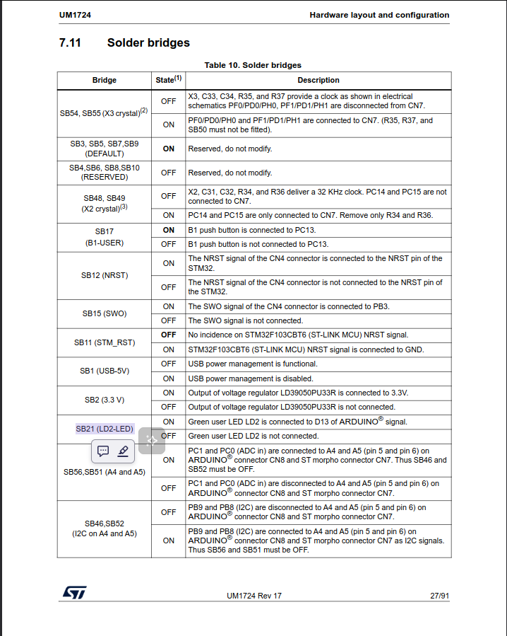 

This proves that the electrical current flows through SB21 in order to reach Arduino. 

There's also a more physical aproach so to speak, to find if a solder bridge is closed or not. For that purpose, let's take a look at the STM32 F446RE-NUCLEO board's backside:

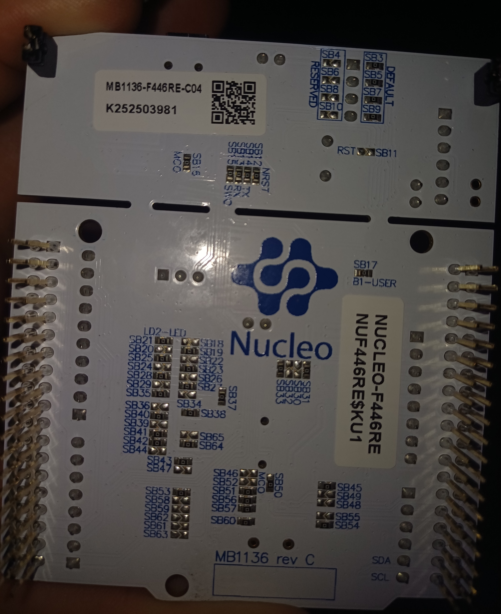 

If a certain solder bridge has a resistor (the black one with a 0 on the center) connecting both metal sides, that SB is closed. On the other hand, if there's no resistor connecting both sides, the SB is open, hence the electrical current doesn't flows through it. 

**Notice that SB21 and SB42 both have the resistor connecting both sides, so there's indeed a closed circuit between LD2 and PA5, Furthermore, the SB29 doesn't present the black resistor, hence it's open**

## 2. Using the multimeter to test if there's actually a closed circuit between LD2 and PA5:

Other way to prove that there's a closed circuit between LD2 and PA5 is using the multimeter, passing 2 Volts through its probes to check if LD2 turns ON the green light. If it does, there's indeed a close circuit between LD2 and PA5, and thats exactly what i proved with the following image.

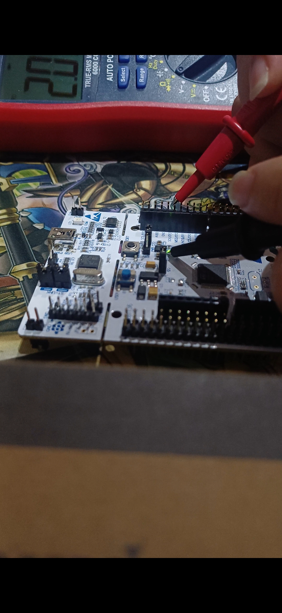 

According to the schematic, there's a 510 ohms resistance between LD2 and SB21, if there's a closed circuit between LD2 and PA5, one can measure the resistance, as follows.

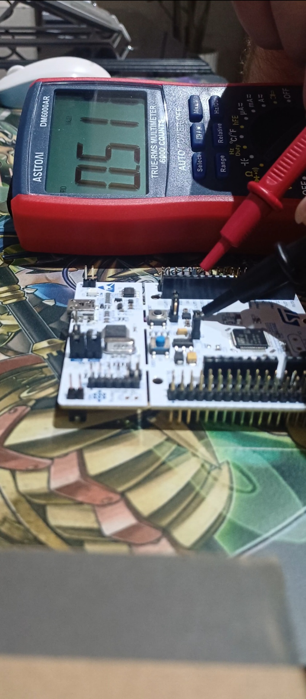  

I actually measured the resistance in kiloohms so the resistance we found was 0.511 kiloohms (511 ohms), which is almost exactly as stated by the schematic.

The conclusion is: **there's a closed circuit between LD2 and PA5.**

## 3. Using the STM32 F446RE-NUCLEO board's reference manual to find the appropriate peripheral registers, and manipulating them with pointers and bitwise operations:

Before manipulating the GPIO registers to work withe PA5 pin, i actually searched in the STM32 F446RE-NUCLEO board's datasheet to find the boards block diagram:

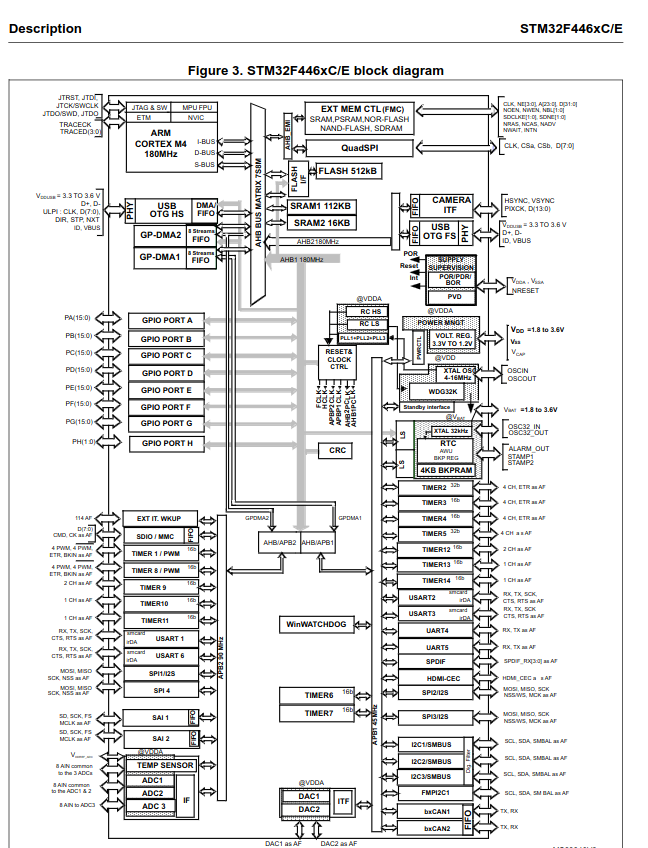

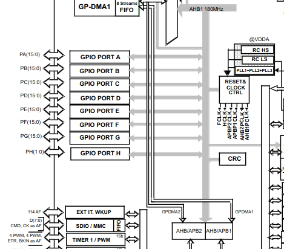

This block diagram reveals that the GPIO Port A peripheral is connected to the AHB1 system bus, so in order to manipulate the GPIOA registers, i need to enable the bus for the GPIO Port A peripheral using the **RCC AHB1 peripheral clock enable register (RCC_AHB1ENR)**. In order to do that, i must refer to the reference manual memory map, to find the starting address of the RCC peripheral:

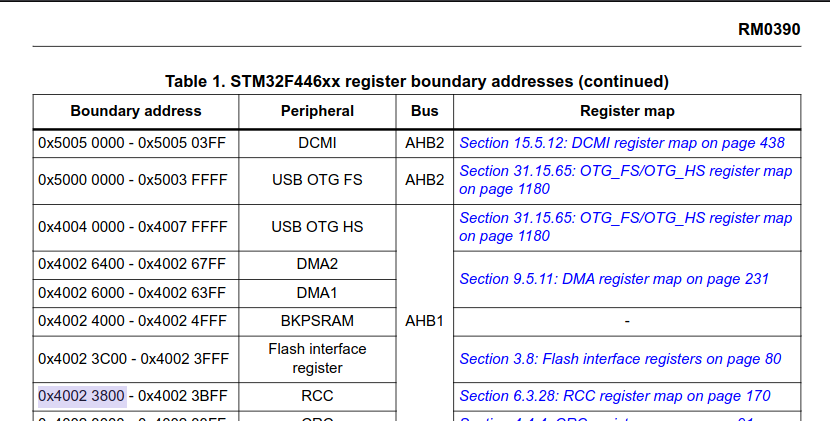

After finding the starting memory address of the RCC peripheral, its necessary to find the RCC AHB1 peripheral clock enable register (RCC_AHB1ENR) also in the reference manual:

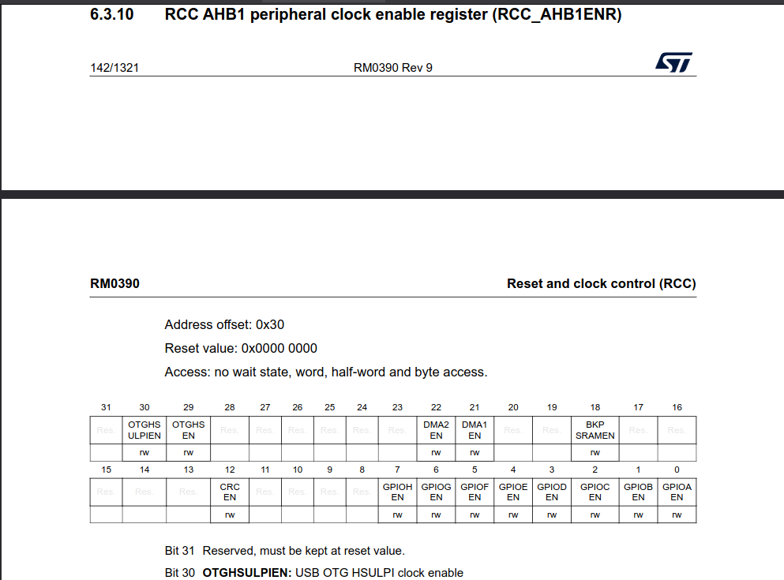

Now i have the offset value, it has to be added to the starting memory address of the RCC peripheral in order to get the exact memory address of this register so:

0x40023800 + 0x30 = 0x40023830

Now that i have the memory address of the RCC_AHB1ENR, there's another important value, which is the reset value, in other words, the value stored by default inside the register when the STM32 F446RE-Nucleo is turned ON, in this case the value is 0x00000000. 

Next i must find the correct bit position to enable the clock for the GPIO port A peripheral, as one might guess by looking at the reference manual, its the bit position 0. i must SET the value stored in bit position 0, from 0 to 1.
For that purpose i use a bitwise OR operation as will be shown later.

The next step is to configure the PA5 pin to output mode, for that purpose i need to go to the reference manual and look for the starting address of the GPIOA peripheral:

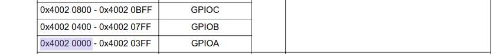

After that, i must find the correct register for changing the mode of the GPIOA PA5 pin to output mode, and it happens to be the **GPIO port mode register (GPIOx_MODER):**

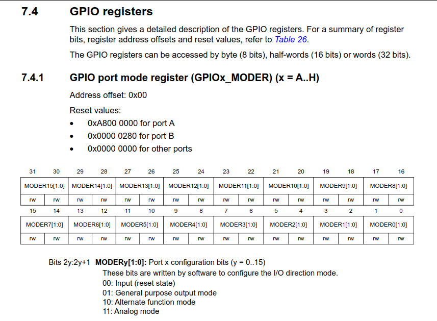

there's a lot of valuable data in the reference manual about the GPIOx_MODER:

Address offset: 0x00

Reset value for GPIOA is: 0xA8000000

In the same way as before, the address of the GPIOx_MODER is obtained by adding the offset value to the starting address of the GPIOA peripheral, but since the address offset is zero, the address of GPIOA port mode register is: 0x40020000

to set the mode for PA5 as output its necesary to manipulate only the bit positions 10 and 11 (MODER5), using bitwise AND operation in order to clear both bit positions and after that, using bitwise OR to set the bit position 10 stored value to 1, by doing this the mode is set as 01: General purpose output mode.

After i set the PA5 GPIO pin to output mode, there's still one last register to manipulate, and that id the **GPIO port output data register (GPIOx_ODR)**, its necessary to refer to the reference manual to find the relevant data:

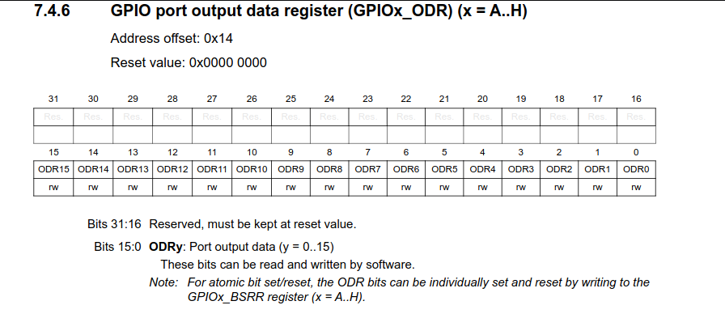

important information found in this section is:

Address offset = 0x14

GPIOA_ODR address:
0x40020000 + 0x14 = 0x40020014

Reset value: 0x00000000

Now i have the address of the GPIOA_ODR register and the rest value. The next step is finding out what pin is necesary to set ON. For setting ON PA5 pin, i need to store the value 1 inside the bit position 5.
this is done with a bitwise OR operation.

After all the above is done, the green user LED must be turn ON. 

## Developed Bare-Metal C program for manipulating bits inside peripheral registers and turning LD2 green user LED ON

The following images contain the source code i wrote in C programming language for embedded systems, using deterministic sized types from stdint.h, let's take a look:

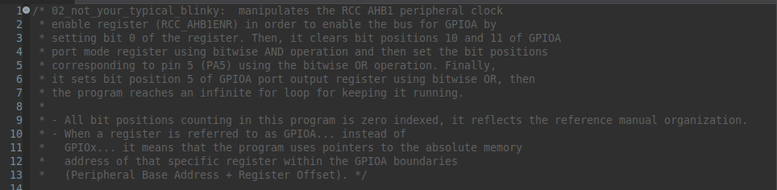 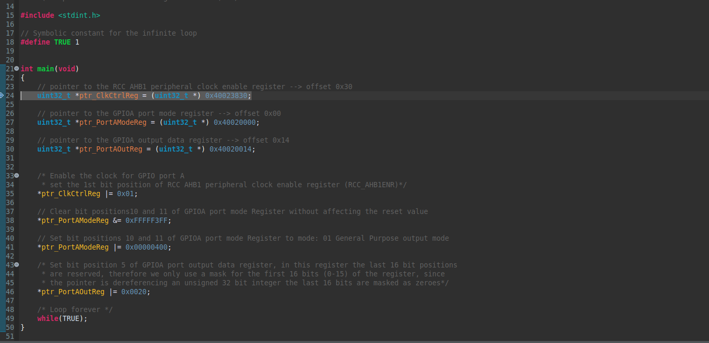

i included **stdint.h** in order to gain access to deterministic sized types. After that i created a symbolic constant named 'TRUE', the replacement text is 1. 
Then i created three pointer variables in order to hold the memory addresses of the peripheral registers that i need to manipulate:

***ptr_ClkCtrlReg**: holds the memory address of the RCC_AHB1ENR.

***ptr_PortAModeReg**: stores the address of the GPIOA port mode register (GPIOA_MODER).

***ptr_PortAOutReg**: holds the memory address of the GPIOA port output data register (GPIOA_ODR).

the first thing i did was to enable the clock for the GPIO port A peripheral, for that purpose i used a bitwise OR operation using the bit mask 0x01 to set the bit position 0 ON (As shown on line 35).

After that, i cleared the bit positions 10 and 11 of GPIOA_MODER using bitwise AND operation with the 0xFFFFF3FF mask. Then i used bitwise OR operation to set bit position 10, using the bit mask 0x00000400 in order to make the pattern of bit positions 10 and 11 as 01 (as shown in lines 38 and 41), which means general purpose output mode.

Finally, i set the bit position 5 of GPIOA_ODR by using bitwise OR operation. After this is done the LD2 green user LED actually turns ON. 

In the final step, control goes to an infinite while loop in order to keep the LED ON). 

