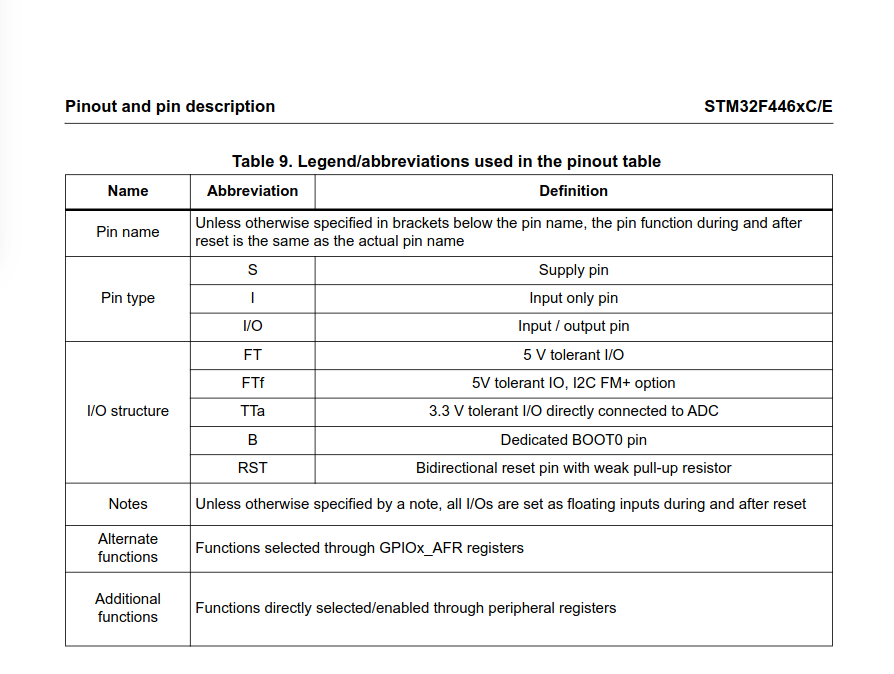
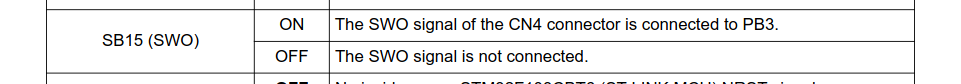
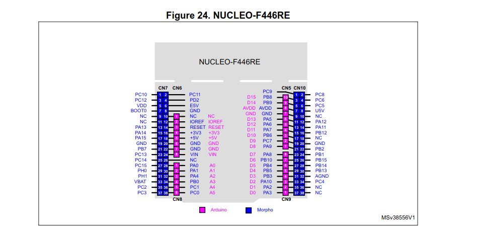
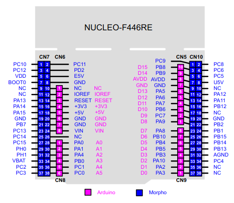
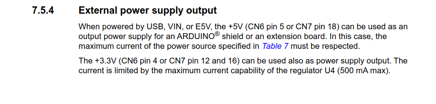
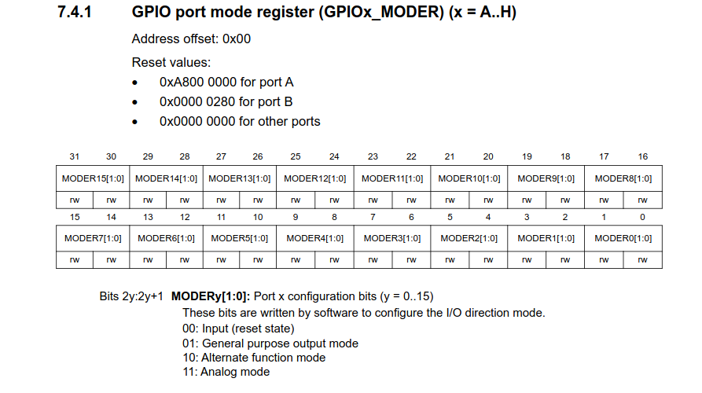
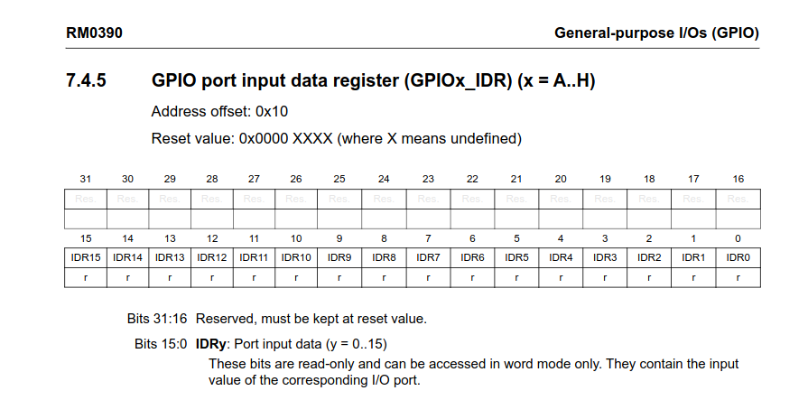
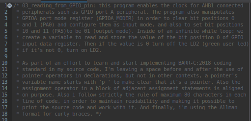
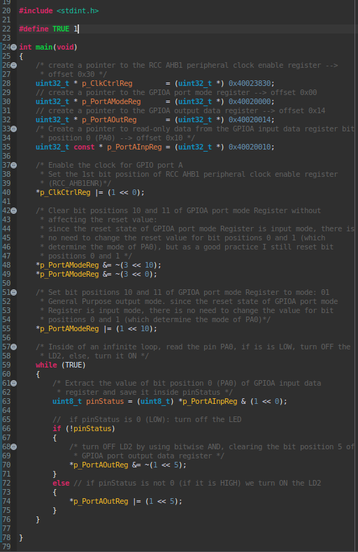

# Project 03: Reading from a GPIO pin

### Quick note for the reader:

This project builds directly upon the bare-metal foundations established in **Project 02: Not your typical blinky.** While the previous project focused exclusively on enabling the clock for peripheral registers connected to AHB1 bus, while setting the mode of GPIO port A pin 5 (*PA5*) as output mode, all of this for configuring PA5 to manipulate the onboard LED (*LD2*).

This implementation introduces **reading** data from a GPIO pin (PA0), via GPIO Input Data Register (*GPIOx_IDR*), previously set in input mode through manipulation of bit positions 0 and 1 of GPIO port A Mode Register (*GPIOA_MODER*). 

To maintain documentation efficiency and avoid redundancy, the step-by-step methodology implemented for calculating peripheral base addresses, register boundary offsets, and fundamental clock enabling for peripherals connected to AHB1 bus (*RCC_AHB1ENR*) is not repeated here. I greatly value your time!

For a comprehensive breakdown of the hardware mapping for the STM32F446RE MCU core, the factory routing bridges, and the register offsets and reset values for *RCC_AHB1ENR* and *GPIOA_MODER* and *GPIOA_ODR* please refer to the core reference: 

**[Go to Project 02: *02_not_your_typical_blinky* - Hardware Mapping & Memory Boundaries Reference](../02_not_your_typical_blinky)** 

## Objectives:

* To set the GPIO port A pin 0 (PA0) as input mode.
* To physically control the logical state of PA0 connecting it to VDD pin or to GND (ground) pin using a jumper wire, in order to get high voltage (HIGH) or no voltage (LOW).
* To continuously read the physical state of the **PA0** pin.
* To dynamically control the state of the green user LED (**LD2**) connected to **PA5** depending on the logical state of PA0.

## Technical Insights:

The key differentiator of this project is the introduction of input reading capabilities at the register level.

## 1. Finding a free GPIO pin to read high/low values:

First of all, I need to find a free GPIO pin, capable of input and output data, in order for that pin to be free, it shall not be physically connected to other important components of the development board. So, I must look inside the STM32 F446RE microcontroller datasheet to find a pin capable of I/O operations. 

The following are the abreviations used in the datasheet for the board's pins:

From the previous table, we need to look after a pin with I/O capabilities and at least 3.3 Volts tolerance, so let's take a look at PA0 in the microcontroller's datasheet:

 

by looking at the previous image, I know that PA0 has input and output capabilities while also having a great 5V tolerance.

But, before moving forward, I need to look inside chapter 7 of the STM32 Nucleo-F446RE development board's user manual in order to know which pins are physically connected and therefore are not free. The following images show precisely these pins:

* **PA5** is connected to LD2.
* **PC13** is connected to B1 user push-button.
* **PA2** and **PA3** are connected to ST-LINK MCU.
* **PB3** is connected to SWO output signal.
* **PA13** and **PA14** are dedicated to SWD protocol signals. 

Since PA0 is not connected to any physically connected to other important components, signals or functions of the STM32 Nucleo-F446RE development board, I can use it to read input data.

## 2. Finding the appropriate pins to establish a physical connection between PA0 and 0V ground (GND) or 3V3 pin:
First of all, I need to look at the extension connectors of the STM32 Nucleo-F446RE development board in order to know their physical location:

Next, I need to figure out which pins for 3V3 and GND are more appropriate to connect to PA0 using a jumper wire:

From the previous image it's possible to know that pin 16 in CN6 outputs approximately 3V. and PA0 is located in CN6 pin number 28, therefore, a connection between these two pins seems conveniuent because they are close enough, also CN6 pin number 20 looks like a convenient option for the GND pin.

From datasheet's table 9. Legend/abbreviations used in the pinout table, we know that an FT pin is 5V Tolerant, and PA0 is stated as a FT pin. That means it can receive 3V without compromising electrical boundaries and hardware safety 

## 3. Finding data about the GPIO Input Data Register in the STM32 Nucleo-F446RE reference manual:

Before I gather any information about the GPIOA input data register, I need to consider several data, the following image taken from the reference manual shows the starting address of GPIOA peripheral:

So, GPIOA starting address is: 0x40020000

After that, just a quick reminder of the GPIO port A mode register taken from the reference manual:

From previous image, it's necessary to keep in mind the offset address of this register, which is 0x00 because it's the first GPIO peripheral register in memory. Also it's important to consider the reset value of port A, this is because MODER0 (bit positions 0 and 1) are 00 by default and that means PA0's mode is configured as input by default (reset state).

Finally I'm able to consider information taken from the reference manual about the GPIOx input data register (GPIOx_IDR):

The first thing I need to do is to calculate the sum of the GPIOA peripheral starting address and the GPIOx_IDR offset value:

0x40020000 + 0x10 = **0x40020010** (memory address of GPIOA_IDR)

So, the memory address of GPIO port A Input Data Register is: **0x40020010**

Next, I noticed that the reset value of this register is: 0x0000XXXX

bit positions 16 to 31 are reserved and are always read as 0 by the CPU, whereas bit positions 0 to 15 are read-only and they convey the input value 0 or 1 read on each pin of the GPIO corresponding port. In my case, I'm going to read input data from PA0 so I need to extract the value of bit position 0 of this register. The details and the implementation are given after explaining the source code.

 
## 4. Developed Bare-Metal C program for reading input data from GPIOA_IDR and depending on the obtained value, turning the green user LED (LD2) ON or OFF:

To avoid repeating whats already explain in internal documentation, the reader should notice the general structure of the code, I defined a symbolic constant called TRUE which simply means 1. Then I declared and initialized four 32 bit unsigned integer pointers that contain the address of four peripheral registers:

* RCC AHB1 Clock Enable Register
* GPIO port A Mode Register
* GPIO port A Output Data Register
* GPIO port A Input Data Register

It's important to notice that the pointer to the address of GPIO_IDR has a const keyword qualifier for the data, that means that p_PortAInpReg is a pointer variable pointing to constant 32 bit unsigned integer data. This is important because the dereferenced data of this pointer must be read-only.

As it is explained in the comments, I used bitwise operations to configure specific bit positions of these peripheral registers in order to achive certain objectives: enabling the clock for GPIOA peripheral, clearing bit positions 0, 1, 10 and 11 of GPIO port A mode register, this is normally achieved by negating a left shift bitwise operation to create a bit mask with zeroes inside the appropriate bit positions, then through a bitwise AND operation, only the bit positions with zeroes on the bit mask are forced to be cleared, the rest remain the same as they were before this operation. After that, I set bit positions 10 and 11 as: '01'. this is achieved by masking bit position 10 of GPIOA_MODER, configuring its value as '1', then, using bitwise OR operation, only this position is forced to be set while the rest remain as they were before the operation.

Next, inside an infinite loop, I extract the value of bit position 0 of GPIO port A Input Data Register using a bit mask of zeroes and setting bit position 0 as '1', then through a bitwise AND operation all bit positions except bit position 0 are cleared and the value extracted is saved inside an 8-bit unsigned integer variable. Finally using a simple selection structure, if the value of the variable is '0', the LD2 is turned OFF and if it's not zero then the LD2 is turned ON, that is achived by configuring bit position 5 of GPIO port A Output Data Register.