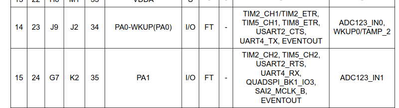
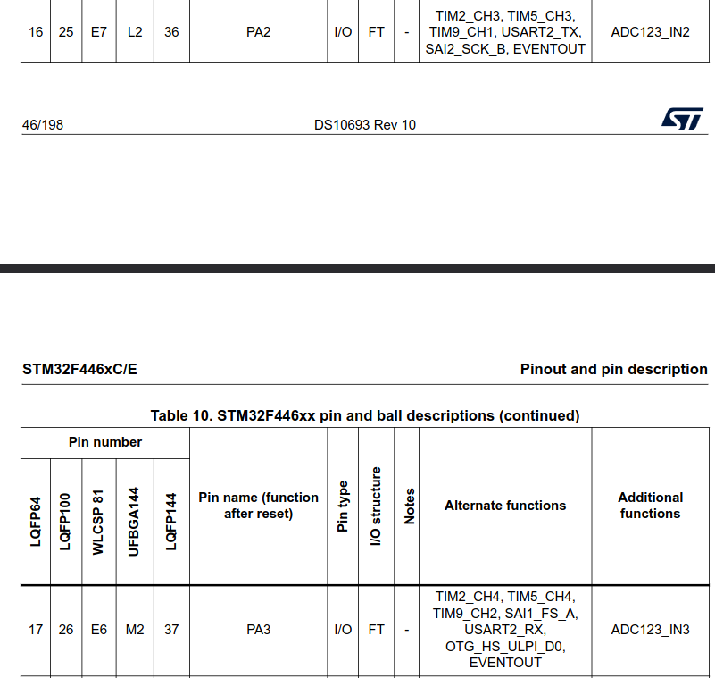
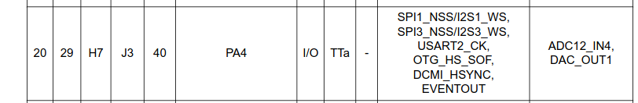
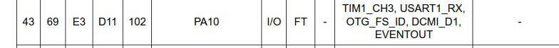
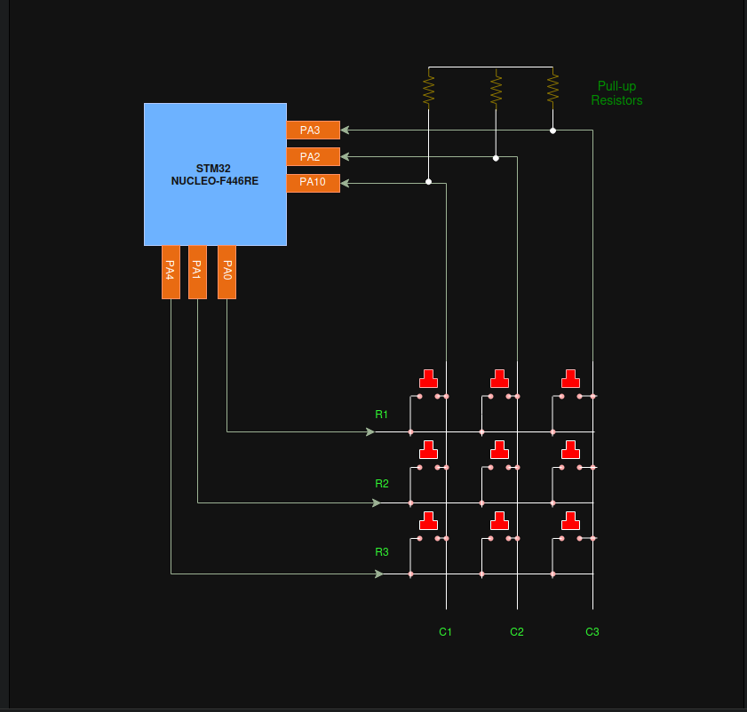

# Project 04: Bare-metal embedded C driver for breadboard designed keypad

This project implements a bare-metal driver developed in embedded C in order to interface a 3x3 matrix keypad built from scratch on a breadboard. The system utilizes a time multiplexed scanning algorithm and low level register manipulation to detect individual key presses and outputs the characters in real time through the ARM Cortex-M4 Instrumentation Trace Macrocell (ITM) to the SWV console.

### Quick note for the reader:

This project builds directly upon the bare-metal foundations established in earlier projects. To maintain documentation efficiency and avoid redundancy, the step-by-step methodology implemented for calculating peripheral base addresses, register boundary offsets, fundamental clock enabling for peripherals, configuring the mode of GPIO pins, finding not free GPIO pins inside the datasheet, are not repeated here. I greatly value your time!

For a comprehensive breakdown of this topics, please refer to earlier projects in this repository.

## Objectives:

* To create create a 3x3 keypad with buttons and jumper wires with three rows of buttons and three columns.
* To find three free GPIO pins that are physically close to each other in order to serve as input/output pins for the keypad.
* To connect three GPIO pins to keypad's rows in output mode and three pins to keypad's columns in input mode.
* To use the STM32 Nucleo-F446RE internal pull-up resistors and to connect them to the GPIO pins reading from the keypad's columns, all of these in order to avoid reading noise from open circuits.
* To develop a a bare-metal embedded C driver for detecting the event of a pressed key and producing the apropriate output (printing the key pressed in the SWV console).  

## Technical insights:

## 1. Finding free I/O pins for detecting the key pressed by the user:  

According to project 03, the following pins are **not** free:

* **PA5** is connected to LD2.
* **PC13** is connected to B1 user push-button.
* **PA2** and **PA3** are connected to ST-LINK MCU.
* **PB3** is connected to SWO output signal.
* **PA13** and **PA14** are dedicated to SWD protocol signals. 

According to the STM32 NUCLEO-F446RE user manual (UM1724), in section 7.12, the following image shows the extension connectors of the board, my goal is to find three free pins that are next to each other, with input/output capabilities and configure them in input mode (for the keypad columns) and other three pins with the same characteristics and configure them in output mode (for the keypad rows).

The pins that match the above requirements are, on CN7: **PA0, PA1, PA4**, on CN10: **PA10, PA2, PA3**. 

Following the STM32F446xC/E datasheet, section 4, the aforementioned pins are described as I/O pins, equipped with input and output capabilities, as the following images extracted from the datasheet demonstrate:

The following pins are going to be configured in output mode and connected to the keypad rows: **PA0, PA1, PA4**.

The following pins are going to be configured in input mode and connected to the keypad columns: **PA10, PA2, PA3**.

## 2. Circuit Operation and Architecture:

Before explaining how the circuit operates and its architecture, let's take a look at the schematic diagram I designed myself:

The schematic is designed around a **row driven (output), column read (input) architecture** optimized for minimizing GPIO pin consumption, this is achieved by implementing a technique known as **multiplexing**. Instead of dedicating 9 individual pins for 9 switches (keys), the matrix connects the buttons in intersecting *rows*: **R1, R2, R3** and *columns*: **C1, C2, C3**, reducing the total development board's hardware connectors usage to just 6 GPIO pins.

### 2.1. Input/Output Pin Configuration:

* **Columns C1, C2, C3**: Connected to *PA10, PA2, and PA3* respectively. These pins are configured as digital Inputs (by using the GPIO port mode register and configuring them in input mode) with their internal Pull-up Resistors enabled (by using the GPIO Port pull-up/pull-down register and configuring the bit positions of each pin as *0b01* or "pull-up"). In their default state (when no key is being pressed), tanks to the pull-up resistors, these lines are pulled to a stable high voltage of 3V3 (3.3V), in this way, the GPIO Input Data Register constantly reads a logical 1 (HIGH) for all columns, avoiding reading electrical noise from open circuits.
* **Rows R1, R2, R3**: Connected to *PA0, PA1, and PA4* respectively. These pins are configured as digital Outputs operating in output mode via the GPIOx_MODER register.

### 2.2. The Multiplexed Scanning Mechanism:

The driver implements an *active LOW* scanning logic inside the main infinite loop. The microcontroller shifts a LOW state across the rows sequentially as follows:

* **Row Activation**: The software drives exactly one row (at a given time) LOW (0) through the GPIO output data register, while maintaining the other two rows forced to HIGH (1).
* **Column Reading**: When a button (key) is physically pressed, it bridges the *active row* with its intersecting *column*, closing the circuit between both. If the active row is grounded (LOW), the high column line path, corresponding to the pressed key is pulled down to **0V**, forcing its specific bit position in GPIO port A input data register to flip from 1 to 0.
* **Decoupling Matrices**: By rotating which row is grounded or configured as LOW at any given millisecond, by using a loop, the processor evaluates the state of 3 buttons at a time, keeping track of the row index and the detected LOW column index to determine the exact pressed key coordinates.

