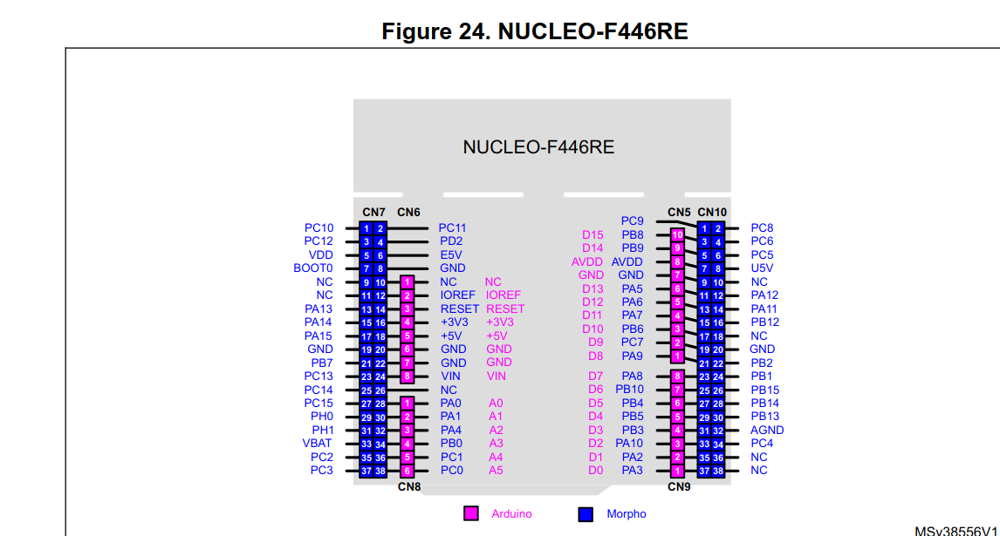

# Project 04: Detecting key press event in keypad

### Quick note for the reader:

This project builds directly upon the bare-metal foundations established in earlier projects. To maintain documentation efficiency and avoid redundancy, the step-by-step methodology implemented for calculating peripheral base addresses, register boundary offsets, fundamental clock enabling for peripherals, configuring the mode of GPIO pins, finding not free GPIO pins inside the datasheet, are not repeated here. I greatly value your time!

For a comprehensive breakdown of this topics, please refer to earlier projects in this repository.

## Objectives:

* To create an integrated circuit with buttons and jumper wires to serve as a keypad with three rows of buttons with three buttons per row.
* To find three free GPIO pins that are physically close to each other in order to serve as input/output pins for the keypad.
* To connect three GPIO pins to keypad's rows in output mode and three pins to keypad's columns in input mode.
* To use the STM32 Nucleo-F446RE internal pull-up resistors and to connect them to the GPIO pins reading from the keypad's columns, all of these in order to avoid reading noise from open circuits.
* To develop a program for detecting the event of a pressed key and producing the apropriate output (printing the key pressed in the SWV console).  

## Technical insights:

## 1. Finding free I/O pins for detecting the key pressed by the user:  

According to project 03, the following pins are **not** free:

* **PA5** is connected to LD2.
* **PC13** is connected to B1 user push-button.
* **PA2** and **PA3** are connected to ST-LINK MCU.
* **PB3** is connected to SWO output signal.
* **PA13** and **PA14** are dedicated to SWD protocol signals. 

According to the STM32 NUCLEO-F446RE user manual (UM1724), in section 7.12, the following image shows the extension connectors of the board, my goal is to find three free pins that are next to each other, with input/output capabilities and configure them in input mode (for the keypad columns) and other three pins with the same characteristics and configure them in output mode (for the keypad rows).

The pins that match the above requirements are, on CN7: PA0, PA1, PA4, on CN10: PA10, PA2, PA3. 

Following the STM32F446xC/E Datasheet, section 4, the aforementioned pins are described as I/O pins, equipped with input and output capabilities, as the following images extracted from the datasheet demonstrate:

The following pins are going to be configured in output mode and connected to the keypad rows: **PA0, PA1, PA4**.

The following pins are going to be configured in input mode and connected to the keypad columns: **PA10, PA2, PA3**.

## 2. 

